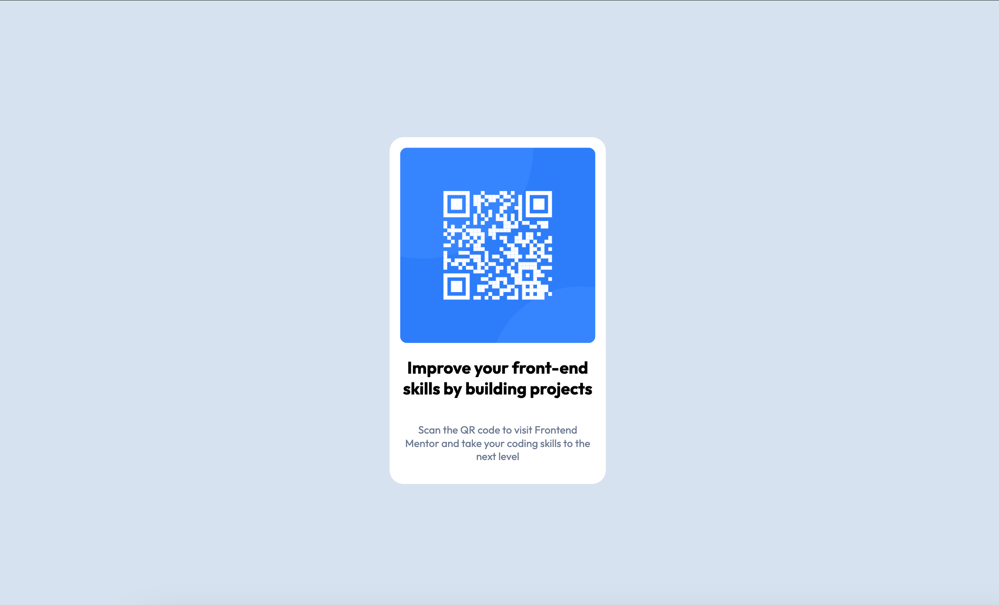

# Frontend Mentor - QR code component solution

This is a solution to the [QR code component challenge on Frontend Mentor](https://www.frontendmentor.io/challenges/qr-code-component-iux_sIO_H). Frontend Mentor challenges help you improve your coding skills by building realistic projects. 

## Overview

### Screenshot

### Links

- Live Site URL: [qr-code-component](https://tamara-mitrovska.github.io/qr-code-component/)

## Built with

- Semantic HTML5 markup
- Flexbox

## Author

- Frontend Mentor - [@Tamara-Mitrovska](https://www.frontendmentor.io/profile/Tamara-Mitrovska)

